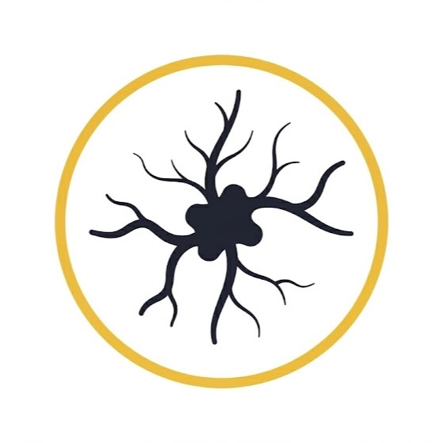
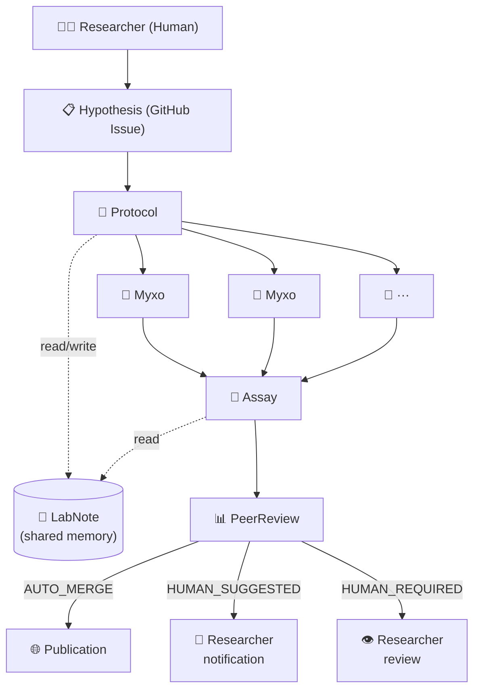
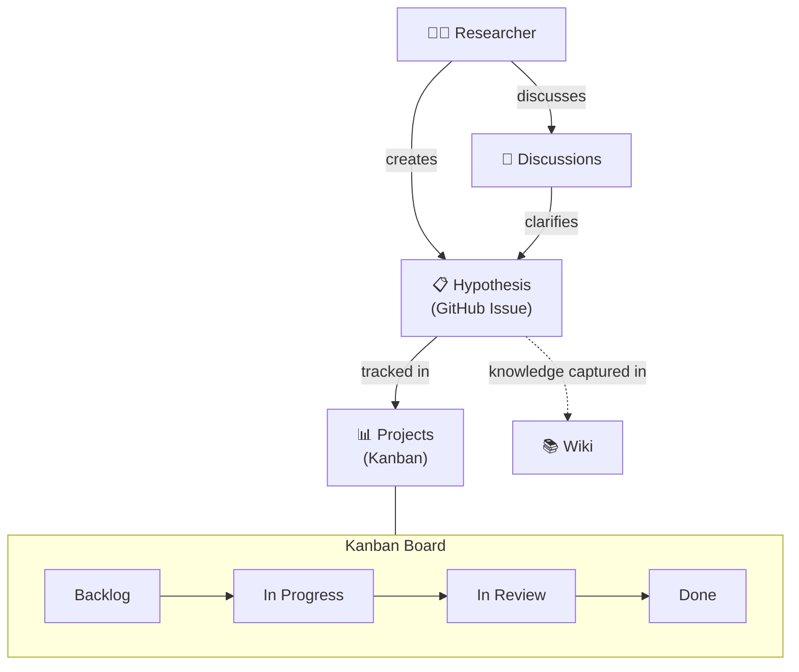

  <picture>
    <source media="(prefers-color-scheme: dark)" srcset="assets/logo-dark.png" />
    <source media="(prefers-color-scheme: light)" srcset="assets/logo-light.png" />
    
  </picture>

<h1 align="center">Myxo</h1>

  <strong>AI Agent Infrastructure Platform — inspired by the distributed intelligence of slime molds.</strong>

  <em>Like Physarum polycephalum solving a maze, Myxo's agents explore, branch, and converge to ship code autonomously.</em>

---

Myxo `/ˈmɪk.soʊ/` orchestrates AI coding agents through a laboratory-experiment metaphor: a **Researcher** designs hypotheses, **Protocols** decompose them into steps, and **Myxos** (worker agents) explore and implement solutions — all verified by rigorous **Assays** before **Publication**.

---

## Terminology

Myxo uses a naming convention drawn from slime mold biology and experimental science.

### Roles

| Role | Pronunciation | Description |
|------|---------------|-------------|
| **Researcher** | — | The human operator. Designs experiments and makes final decisions. |
| **Protocol** | — | The director agent. Decomposes a Hypothesis into parallel tasks and assigns them to Myxos. |
| **Myxo** | `/ˈmɪk.soʊ/` | Worker agents — the cultured slime molds that explore the environment and bring results back. |
| **Assay** | `/ˈæs.eɪ/` | The reviewer agent. Performs quality analysis on Myxo output, including code review and risk evaluation. |
| **Report** | — | The explainer agent. Generates documentation and summaries of changes (experiment reports). |

### Concepts

| Concept | Pronunciation | Description |
|---------|---------------|-------------|
| **Hypothesis** | — | A task definition (GitHub Issue). "We hypothesize this can be solved." |
| **Procedure** | — | A workflow definition executed in Temporal. The concrete steps to test a Hypothesis. |
| **PeerReview** | — | The merge-decision evaluator. Classifies PRs as `AUTO_MERGE`, `HUMAN_SUGGESTED`, or `HUMAN_REQUIRED`. |
| **Experiment** | — | A unit of work. A Hypothesis being actively tested. |

### Environments & Memory

| Name | Pronunciation | Description |
|------|---------------|-------------|
| **Petri** | `/ˈpiː.tri/` | Preview / staging environment — an isolated dish for running experiments safely. |
| **Publication** | — | Production environment — verified results released to the world. |
| **LabNote** | — | Global shared memory (S3 JSON). Knowledge accumulated across all experiments. |
| **BenchNote** | — | Per-repository memory. Observations specific to one codebase (bench notes from the lab). |
| **.myxo-lab/** | — | Configuration directory at the repository root. Contains rules, protocols, and agent definitions. |

---

## Architecture Overview

### Experiment Execution Flow

How a Hypothesis travels from idea to production.

### Project Management Flow

How experiments are tracked, discussed, and documented.

### Technology Stack

| Layer | Technology |
|-------|------------|
| Workflow Orchestration | [Temporal](https://temporal.io) |
| Infrastructure as Code | [Pulumi](https://pulumi.com) (Python) |
| CI/CD | GitHub Actions |
| Agent Execution | Claude Code via [claude-code-action](https://github.com/anthropics/claude-code-action) |
| Observability | OpenTelemetry + Langfuse |
| Code Intelligence | GitNexus, Serena |
| Sandbox | E2B |

---

## The Metaphor

**Why slime mold?**

[*Physarum polycephalum*](https://en.wikipedia.org/wiki/Physarum_polycephalum) is a single-celled organism with no brain, yet it can:

- **Solve mazes** by exploring all paths simultaneously and pruning dead ends
- **Recreate optimal networks** — famously replicating the Tokyo rail system
- **Remember without a brain** — leaving chemical traces as external memory
- **Split and merge** — dividing to explore in parallel, fusing to share findings

This is exactly how Myxo's agents work: they extend into a codebase like cultured slime molds, explore multiple approaches in parallel, leave traces (LabNotes) for future reference, and converge on the optimal solution — all without central command.

---

## Project Status

🧪 **Phase 1: Proof of Concept** — Foundation, CLI, Pulumi infrastructure, GitHub Actions procedures

📋 See the [project board](https://github.com/June3141/myxo-lab/projects) and [milestones](https://github.com/June3141/myxo-lab/milestones) for detailed progress.

---

## License

TBD
